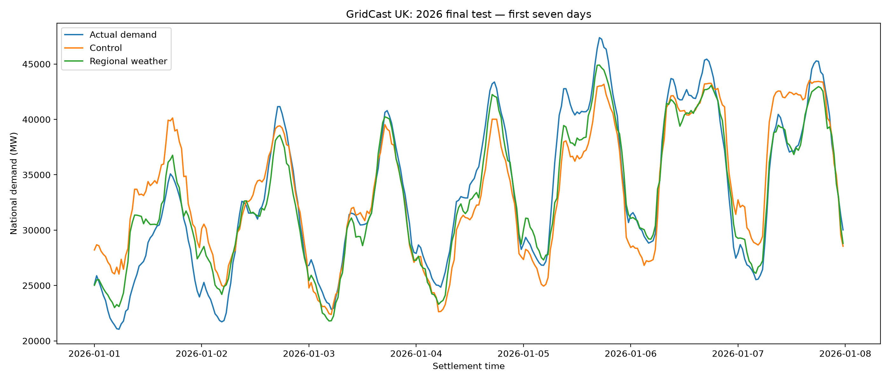
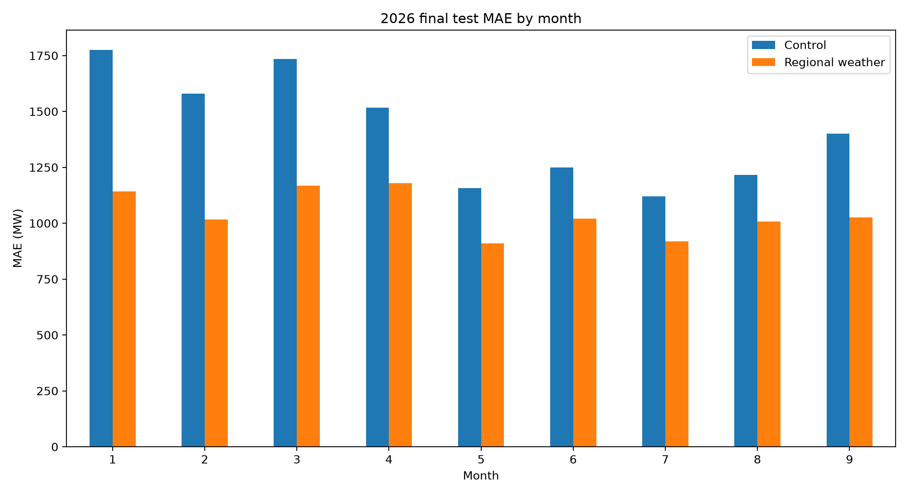
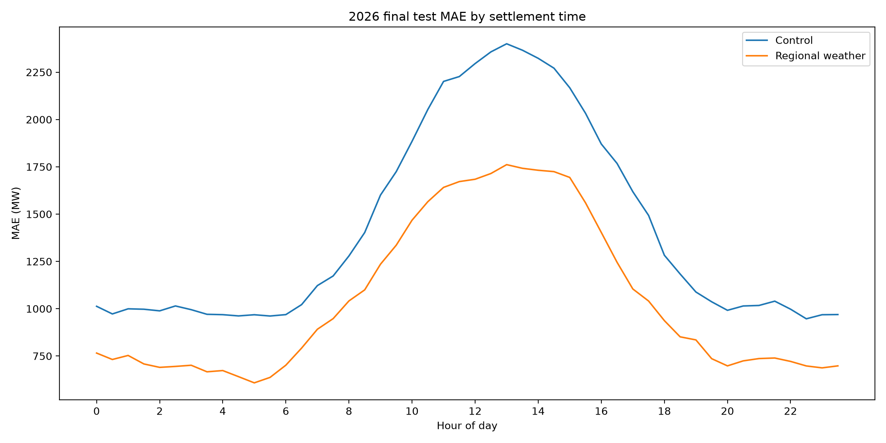
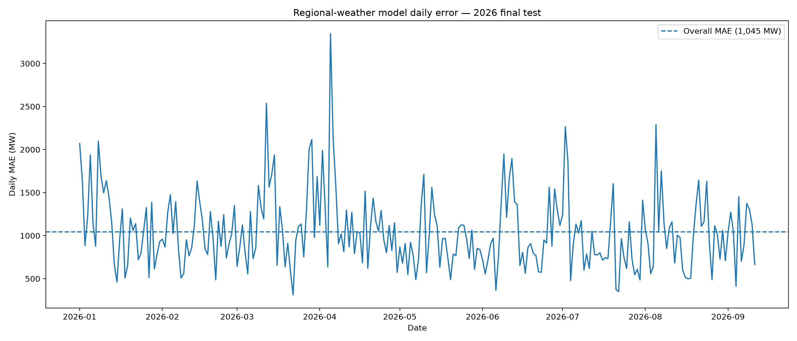

# GridCast UK

Machine-learning forecasting of Great Britain electricity demand using historical demand patterns, calendar effects, public holidays, and archived regional weather forecasts.

## Overview

GridCast UK is an end-to-end time-series machine-learning project for forecasting Great Britain National Demand at half-hourly resolution.

The project combines:

- NESO historical electricity demand data
- calendar and cyclical time features
- England & Wales and Scotland public-holiday indicators
- demand lag features
- archived weather forecasts from eight UK locations
- temporal model validation
- gradient-boosting regression
- out-of-time testing on previously untouched 2026 data

The final model achieved:

| Model | 2026 MAE | 2026 RMSE |
|---|---:|---:|
| Demand/calendar control | 1,416 MW | 1,927 MW |
| **Regional-weather model** | **1,045 MW** | **1,418 MW** |
| **Improvement** | **26.25%** | **26.40%** |

The final test period was kept untouched during model and feature development.

---

## Problem

Electricity demand varies systematically with:

- time of day
- day of week
- season
- public holidays
- recent demand
- temperature
- sunlight
- wind
- cloud conditions

A purely autoregressive model can therefore struggle when tomorrow's conditions differ substantially from recent days.

GridCast UK investigates whether historical weather forecasts that would have been available before the target period can improve demand forecasts without introducing target-time weather leakage.

---

## Data

### Electricity demand

Historical demand data is collected from the National Energy System Operator (NESO).

The dataset covers:

**January 2021 to September 2026**

with half-hourly settlement periods.

The core target is:

`national_demand_mw`

The processing pipeline also handles UK daylight-saving transitions, including days with 46, 48, or 50 settlement periods.

### Weather

Weather forecasts come from the Open-Meteo Previous Runs API.

Rather than using observed weather at the target time, the project uses archived forecast variables produced approximately one day earlier.

This is important because using realised target-time weather would introduce information that would not have been available when the prediction was made.

Weather is collected for eight locations:

- Birmingham
- Cardiff
- Edinburgh
- Glasgow
- Leeds
- London
- Manchester
- Newcastle

Variables include:

- 2 m temperature
- shortwave solar radiation
- cloud cover
- 10 m wind speed

Hourly forecasts are interpolated to the half-hourly electricity-demand timestamps.

---

## Forecasting setup

The current forecasting setup predicts demand for a settlement period using information available from previous calendar days together with archived weather forecasts.

Demand lag features are matched using:

`settlement_date + settlement_period`

rather than simple row offsets.

This keeps lag construction robust to UK daylight-saving changes.

Important lag features include:

- previous-day demand
- two-day lag
- previous-week demand
- previous-day demand change

---

## Validation strategy

Random train/test splitting would leak future information into the training data, so all experiments use chronological splits.

Initial model selection used expanding-window validation:

```text
2021          -> 2022
2021–2022     -> 2023
2021–2023     -> 2024
```

Weather-rich development was then evaluated using:

```text
2024 weather-covered data -> training
2025                      -> validation
```

After the model specification was frozen, the model was retrained using the available 2024–2025 weather-covered development data.

The final test was then performed once on:

```text
January 2026 -> September 2026
```

No 2026 observations were used for feature selection or hyperparameter tuning.

---

## Baselines

Several increasingly strong baselines were evaluated.

### Previous-day seasonal naive

Predict demand from the same settlement period on the previous calendar day.

2025:

- MAE: ~1,847 MW
- RMSE: ~2,575 MW

### Previous-week seasonal naive

Predict demand from the equivalent settlement period seven days earlier.

2025:

- MAE: ~2,179 MW
- RMSE: ~2,917 MW

### Weighted seasonal baseline

A historical experiment selected:

```text
60% previous-day prediction
40% previous-week prediction
```

2025:

- MAE: ~1,611 MW
- RMSE: ~2,203 MW

This provides a substantially stronger benchmark than a single seasonal-naive forecast.

---

## Machine-learning models

### Ridge regression

Ridge regression was used as an interpretable linear benchmark.

Features included:

- cyclical hour
- cyclical weekday
- cyclical month
- weekend indicator
- demand lags
- recent demand change

2025 validation:

- MAE: ~1,492 MW
- RMSE: ~1,985 MW

### Histogram Gradient Boosting

A `HistGradientBoostingRegressor` was selected for the nonlinear model.

Temporal model selection produced the frozen configuration:

```python
learning_rate = 0.05
max_leaf_nodes = 15
max_iter = 400
```

Demand-only 2025 validation performance:

- MAE: ~1,314 MW
- RMSE: ~1,774 MW

---

## Weather ablation study

To isolate the contribution of different weather variables, all experiments used the same training rows, validation rows, model class, and hyperparameters.

| Feature set | 2025 MAE | Improvement vs control |
|---|---:|---:|
| Control | 1,531 MW | — |
| + Temperature | 1,394 MW | 8.92% |
| + Solar radiation | 1,442 MW | 5.76% |
| + Temperature + radiation | 1,299 MW | 15.11% |
| **+ All weather** | **1,157 MW** | **24.39%** |

Temperature was the strongest individual weather feature, but solar radiation, wind, and cloud information added complementary predictive signal.

---

## Regional weather

A national-average weather representation discards geographic variation.

The project therefore compares:

```text
4 national-average weather variables
```

against:

```text
8 locations × 4 weather variables
= 32 regional weather features
```

On the 2025 validation set:

| Weather representation | MAE | RMSE |
|---|---:|---:|
| National average | 1,154 MW | 1,595 MW |
| **Regional weather** | **1,131 MW** | **1,553 MW** |

Preserving regional information reduced MAE by a further **1.93%** and RMSE by **2.60%**.

---

## Weather importance

Grouped permutation analysis showed the following increase in MAE when each weather family was disrupted:

| Weather group | MAE increase |
|---|---:|
| Temperature | 386 MW |
| Solar radiation | 291 MW |
| Wind speed | 271 MW |
| Cloud cover | 48 MW |

All eight geographic locations contributed positive predictive information.

Birmingham and London had the largest grouped permutation effects in the fitted regional model.

Permutation importance should be interpreted as predictive importance rather than causal effect, particularly because weather variables are correlated.

---

## Final 2026 test

After model selection was complete, the regional-weather model was frozen and evaluated on the untouched 2026 holdout.

| Model | MAE | RMSE | Mean error |
|---|---:|---:|---:|
| Control | 1,416 MW | 1,927 MW | -122 MW |
| **Regional weather** | **1,045 MW** | **1,418 MW** | **-193 MW** |

Relative to the matched control:

- MAE improved by **26.25%**
- RMSE improved by **26.40%**

The negative mean error indicates a small average overprediction bias because error is defined as:

```text
actual demand - predicted demand
```

Weather improved MAE in every month of the available 2026 test period.

The largest percentage improvements occurred during winter:

- January: 35.7%
- February: 35.6%
- March: 32.7%

---

## Final-test visualisations

### Actual vs predicted demand



### Monthly forecasting error



### Error by settlement time



### Daily model error



---

## Project structure

```text
gridcast-uk/
│
├── data/
│   ├── raw/
│   └── processed/
│
├── notebooks/
│   └── 01_eda.ipynb
│
├── reports/
│   ├── figures/
│   └── tables/
│
├── scripts/
│   ├── data/
│   │   ├── build_features.py
│   │   ├── build_historical_dataset.py
│   │   ├── build_regional_weather_features.py
│   │   ├── build_regional_weather_test_2026.py
│   │   ├── download_historical_neso.py
│   │   ├── download_weather_2026.py
│   │   └── download_weather_forecasts.py
│   │
│   ├── experiments/
│   │   ├── analyze_model_errors.py
│   │   ├── analyze_regional_weather_importance.py
│   │   ├── analyze_weather_improvement.py
│   │   ├── build_weather_features.py
│   │   ├── compare_regional_weather.py
│   │   ├── compare_weather_model.py
│   │   ├── evaluate_baselines.py
│   │   ├── run_weather_ablation.py
│   │   ├── train_gradient_boosting.py
│   │   ├── train_ridge.py
│   │   ├── tune_gradient_boosting.py
│   │   └── tune_ridge.py
│   │
│   ├── evaluation/
│   │   └── evaluate_final_test_2026.py
│   │
│   └── reporting/
│       └── report_final_test_2026.py
│
├── src/
│   └── gridcast_uk/
│       ├── data/
│       ├── evaluation/
│       ├── features/
│       └── models/
│
├── tests/
├── pyproject.toml
├── uv.lock
└── README.md
```

---

## Reproducibility

The project uses `uv` for dependency and environment management.

Install dependencies:

```bash
uv sync
```

Run tests:

```bash
uv run pytest
```

Example model-evaluation command:

```bash
uv run python scripts/evaluation/evaluate_final_test_2026.py
```

---

## Key technical considerations

Several modelling decisions were made specifically to avoid misleading performance estimates:

- chronological rather than random validation
- untouched final out-of-time test set
- weather forecasts rather than realised future weather
- DST-safe calendar-day lag construction
- matched rows when comparing weather and non-weather models
- baseline comparison before increasing model complexity
- feature ablation before selecting the final weather representation

---

## Limitations

The current project has several limitations.

The rich historical weather-forecast archive is shorter than the electricity-demand history, so the final weather model is trained using a smaller historical window than the demand-only experiments.

The eight selected cities are a practical approximation of GB-wide weather conditions rather than an electricity-demand-weighted spatial model.

Regional weather features are currently treated independently rather than being weighted by population, embedded solar capacity, or regional electricity consumption.

The current target construction should also be interpreted as a next-calendar-day same-settlement-period forecasting setup rather than a production fixed-origin batch forecast of all settlement periods from one daily issuance time.

---

## Next steps

The modelling specification is frozen for GridCast UK V1.

The next development phase focuses on production engineering:

- reusable training pipeline
- model persistence
- prediction interface
- API
- Docker
- automated testing with GitHub Actions
- deployment / cloud architecture

---

## Tech stack

- Python
- pandas
- NumPy
- scikit-learn
- matplotlib
- httpx
- PyArrow
- pytest
- uv
- Git / GitHub

---

## Author

Leo Hsin

MSc Data Science, University College London  
BSc Mathematics, King's College London